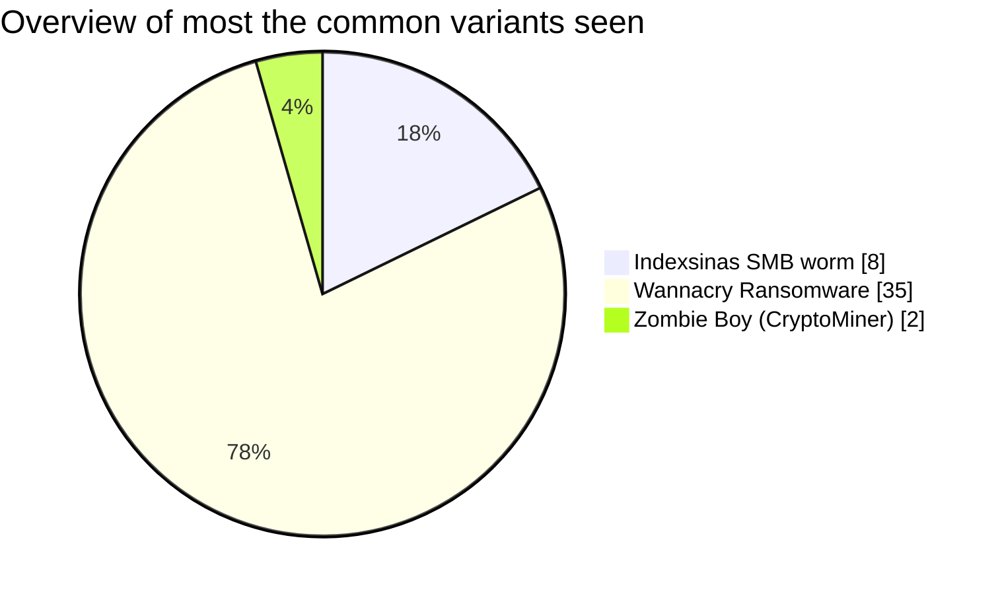
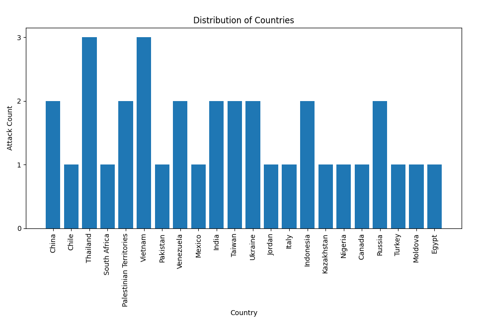

# HoneyPot-Analysis
This is a newly created repository which provides analysis on any interesting malicious samples which arrive in my AWS hosted Honeypot
  

## Most frequently seen Malware Variants

## Malware Submission Based on IP Geolocation Data

