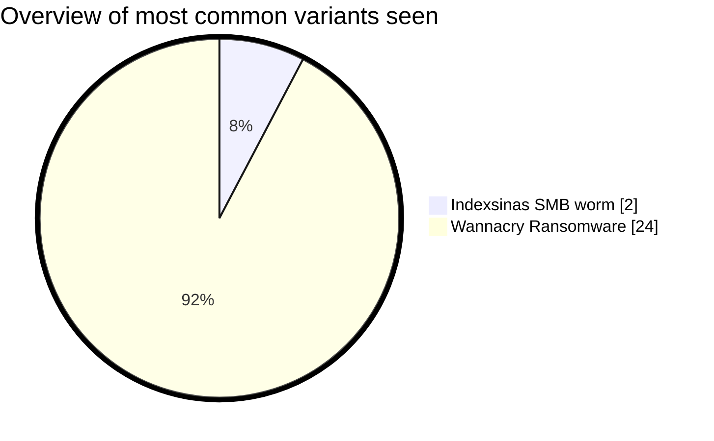

# HoneyPot-Analysis
This is a repository which provides analysis on malicious samples which arrive in my AWS hosted Honeypot
  

```mermaid
 %%{init: {"pie": {"textPosition": 0.5}, "themeVariables": {"pieOuterStrokeWidth": "5px"}} }%%
pie showData
    title Overview of most common variants seen
    "Indexsinas SMB worm" : 2
    "Wannacry Ransomware" : 24

```
