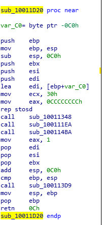
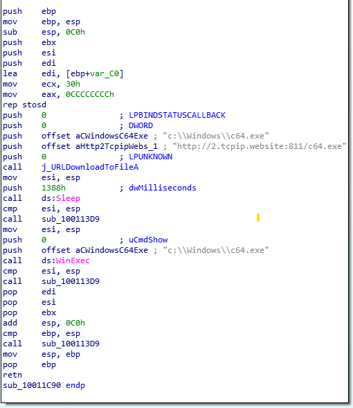

# Indexinas SMB Worm (A Brief Analysis)

SHA-256:  **8a7f479d9c6cbe277d760844917a979ba17f3e07be479c205d1491e682a71866**   **761c6f1737f2b059214b31bfe7659285f4c2c9688a7ada65f92cba6d65f55253**  **56dededa09c602a20079ec6aa5b5be0cab897c92f2b5ad98c9d9c1f401b13fd7**

File Type: **32-bit Windows DLL**

Which country did these samples arrive from:   **Moldova**   **Venezuela**   **Thailand**

This sample is an SMB Worm known as Indexinas, it arrived in my honeypot through SMB protocol and it has a couple of different features I will talk about.

   

## Main Function:
The main function contains a bunch of calls to functions as we can see below, the three functions, sub_10011348, sub_100111EA and sub_100114BA are used to download additional malicious files onto the victims machine.

    

## Sub_10011348

If we step into one of these functions we can clearly see it is using the "URLDownloadToFile" function to download an executable from http[://]2[.]tcpip[.]website[:]811/c64[.]exe and save it to "C:\\Windows\\c64.exe". It will then sleep and use WinExec to run this newly downloaded executable.

### What files are being downloaded?
Each of the functions we talked about earlier are responsible for downloading different files, in the end this worm ends up downloading a RAT which is saved as "86.exe" a cryptominer  which is saved as "iexplore.exe" and a propagation tool known as "Ctfmon" which is saved as the file we talked about above "c64.exe".

## Overall 
This SMB Worm targets servers which are vulnerable to the [Eternal Blue Exploit](https://www.cisecurity.org/wp-content/uploads/2019/01/Security-Primer-EternalBlue.pdf#:~:text=EternalBlue%20is%20an%20exploit%20that%20allows%20cyber%20threat,to%20a%20network%20by%20sending%20specially%20crafted%20packets.). It downloads three different malicious files on the victims computer and even deploys a cryptominer to steal resources for their private mining pool.

